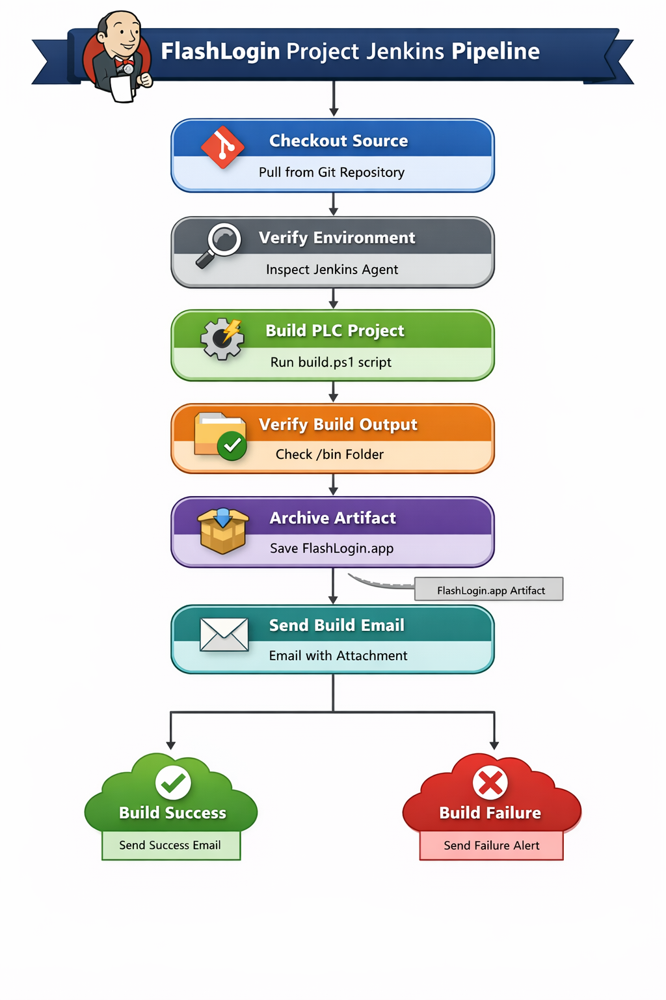

## 1. Jenkins CI/CD Pipeline Flow

The following diagram illustrates the Jenkins CI/CD pipeline for the FlashLogin project:



---

# 2. Complete Project Structure

Example repository:

```
FlashLoginProject/
│
├── Jenkinsfile
│
├── build/
│   └── build.ps1
│
├── project/
│   ├── FlashLogin.project
│   └── config.xml
│
├── src/
│   ├── FlashLogin.st
│   └── LoginTypes.st
│
├── test/
│   └── LoginTestCases.md
│
├── bin/
│   └── (Generated build artifacts)
│
└── README.md
```

Explanation:

| Folder      | Purpose                       |
| ----------- | ----------------------------- |
| src         | Structured Text source code   |
| project     | Solution Center project files |
| build       | build automation scripts      |
| bin         | compiled output               |
| Jenkinsfile | CI/CD pipeline                |
| test        | test documentation            |

---

# 3. Structured Text Login Program

File:

```
src/FlashLogin.st
```

```pascal
PROGRAM FlashLogin

VAR
    inputUser : STRING[32];
    inputPassword : STRING[32];

    storedUser : STRING[32] := 'admin';
    storedPassword : STRING[32] := 'flash123';

    loginAttempt : BOOL := FALSE;
    loginSuccess : BOOL := FALSE;
    loginFailure : BOOL := FALSE;

END_VAR


IF loginAttempt THEN

    IF (inputUser = storedUser) AND (inputPassword = storedPassword) THEN
        loginSuccess := TRUE;
        loginFailure := FALSE;
    ELSE
        loginSuccess := FALSE;
        loginFailure := TRUE;
    END_IF;

    loginAttempt := FALSE;

END_IF;

END_PROGRAM
```

---

# 4. Supporting Type File

```
src/LoginTypes.st
```

```pascal
TYPE LoginStatus :
(
    IDLE,
    AUTHENTICATED,
    FAILED
);
END_TYPE
```

---

# 5. Build Script (Production Automation)

File:

```
build/build.ps1
```

PowerShell script to compile project.

```powershell
Write-Host "Starting Solution Center build..."

$projectPath = "..\project\FlashLogin.project"
$outputFolder = "..\bin"

if (!(Test-Path $outputFolder)) {
    New-Item -ItemType Directory -Path $outputFolder
}

$solutionCenterCLI = "C:\Program Files\SolutionCenter\bin\SolutionCenterCLI.exe"

& "$solutionCenterCLI" build $projectPath --output $outputFolder

if ($LASTEXITCODE -ne 0) {
    Write-Host "Build Failed"
    exit 1
}

Write-Host "Build Completed Successfully"
```

---

# 6. Jenkins Pipeline for FlashLogin PLC Project

This Jenkins pipeline automates the build, verification, archiving, and notification process for the FlashLogin PLC project. It uses a `jenkins.war` setup on a Windows agent with PowerShell scripts.

## Pipeline Overview

- **Checkout Source:** Pulls code from the Git repository.
- **Verify Environment:** Checks Jenkins agent directories and files.
- **Build PLC Project:** Executes Solution Center CLI build script.
- **Verify Build Output:** Confirms compiled artifacts exist in the `/bin` folder.
- **Archive Artifact:** Stores compiled `.app` files in Jenkins.
- **Send Build Email:** Notifies developers with the build result and attaches the artifact.

## Jenkinsfile

```groovy
pipeline {
    agent any

    environment {
        // ============================
        // Environment Setup
        // ----------------------------
        BUILD_OUTPUT = "bin"
        ARTIFACT_PATTERN = "bin/*.app"
    }

    stages {

        // ============================
        // Stage 1: Checkout Source Code
        // ----------------------------
        stage('Checkout Source') {
            steps {
                git branch: 'main',
                    url: 'https://github.com/cicd-pipeline-automation/FlashLoginProject.git'
            }
        }

        // ============================
        // Stage 2: Verify Jenkins Environment
        // ----------------------------
        stage('Verify Environment') {
            steps {
                powershell 'Get-ChildItem'
            }
        }

        // ============================
        // Stage 3: Build PLC Project
        // ----------------------------
        stage('Build PLC Project') {
            steps {
                powershell './build/build.ps1'
            }
        }

        // ============================
        // Stage 4: Verify Build Output
        // ----------------------------
        stage('Verify Build Output') {
            steps {
                powershell 'Get-ChildItem bin'
            }
        }

        // ============================
        // Stage 5: Archive Artifact
        // ----------------------------
        stage('Archive Artifact') {
            steps {
                archiveArtifacts artifacts: 'bin/*.app', fingerprint: true
            }
        }

        // ============================
        // Stage 6: Send Build Email
        // ----------------------------
        stage('Send Build Email') {
            steps {
                emailext(
                    subject: "FlashLogin PLC Build Success - ${BUILD_NUMBER}",
                    body: """
                        Build Completed Successfully.

                        Job Name: ${JOB_NAME}
                        Build Number: ${BUILD_NUMBER}

                        The compiled artifact from the bin folder is attached.
                    """,
                    to: "devopsuser8413@gmail.com",
                    attachmentsPattern: "bin/*.app"
                )
            }
        }

    }

    post {
        // ============================
        // Post-build Actions
        // ----------------------------
        success {
            echo "Build Completed Successfully"
        }

        failure {
            emailext(
                subject: "FlashLogin Build FAILED",
                body: "Build failed. Check Jenkins logs for details.",
                to: "devopsuser8413@gmail.com"
            )
        }
    }
}
```

---

# 7. Jenkins Plugin Requirements

Install these plugins:

| Plugin                 | Purpose             |
| ---------------------- | ------------------- |
| Pipeline               | pipeline execution  |
| Git                    | repository checkout |
| Email Extension Plugin | send build emails   |
| Pipeline Utility Steps | artifact utilities  |

---

---

# 8. Login Test Cases

[Login Test Cases](tests/LoginTestCases.md)

---

---
# 9. Jenkins Email Configuration

Go to:

```
Manage Jenkins
→ Configure System
→ Extended Email Notification
```

Example SMTP:

```
SMTP Server: smtp.company.com
Port: 587
Use TLS: true

Username: jenkins@company.com
Password: ********
```

Default email:

```
jenkins@company.com
```

---

# 10. Create Jenkins Job

Steps:

```
Jenkins Dashboard
→ New Item
→ Pipeline
```

Name:

```
FlashLogin-CICD
```

Pipeline Source:

```
Pipeline script from SCM
```

SCM:

```
Git
```

Repository:

```
https://github.com/cicd-pipeline-automation/FlashLoginProject.git
```

Branch:

```
main
```

Script path:

```
Jenkinsfile
```

Save.

---

# 11. Execution Flow

When pipeline runs:

```
Developer commits code
      │
      ▼
Git repository updated
      │
      ▼
Jenkins pipeline triggered
      │
      ▼
Checkout repository
      │
      ▼
Run build.ps1
      │
      ▼
Solution Center compiles project
      │
      ▼
bin/FlashLogin.app generated
      │
      ▼
Artifact archived
      │
      ▼
Email sent with attachment
```

---

# 12. Expected Build Output

```
bin/
 └── FlashLogin.app
```

Example email attachment:

```
FlashLogin.app
```

---

# 13. Example Jenkins Console Output

```
[Pipeline] Checkout Source
Cloning repository...

[Pipeline] Build PLC Project
Starting Solution Center build...
Build Completed Successfully

[Pipeline] Verify Build Output
FlashLogin.app

[Pipeline] Archive Artifact
Archiving artifacts

[Pipeline] Send Build Email
Email sent successfully
```

---

# 14. Production CI/CD Best Practices

Recommended improvements:

✔ Add **Git webhook triggers**
✔ Add **version tagging**
✔ Upload artifacts to **Artifactory / Nexus**
✔ Add **unit tests for PLC logic**
✔ Add **multi-branch pipeline**

---
